# Flow Diagrams

Visual step-by-step diagrams for every process in the CI/CD pipeline and infrastructure.

---

## 1. End-to-End Development Flow

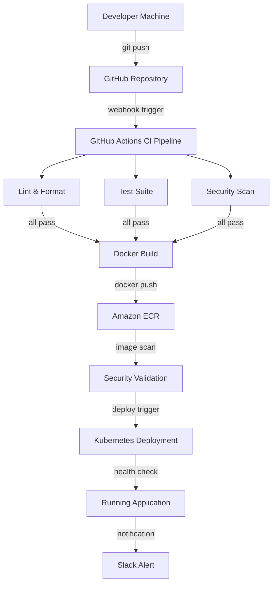

---

## 2. Infrastructure Provisioning Flow

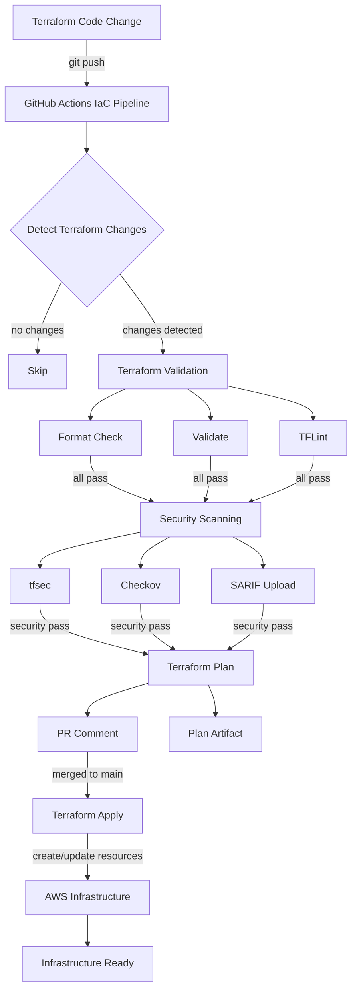

---

## 3. Application Request Flow

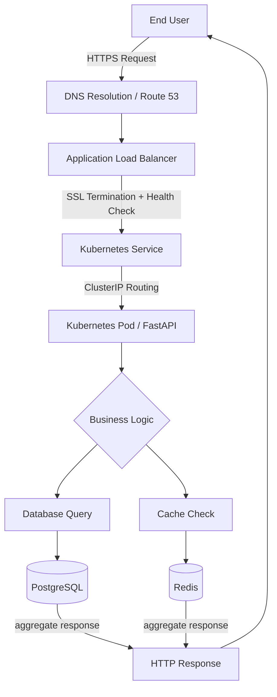

---

## 4. Security Authentication Flow

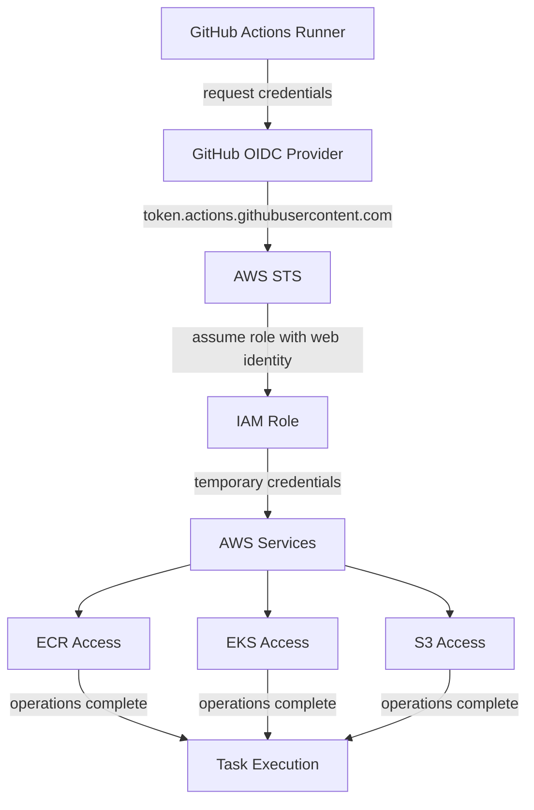

---

## 5. Kubernetes Deployment Flow

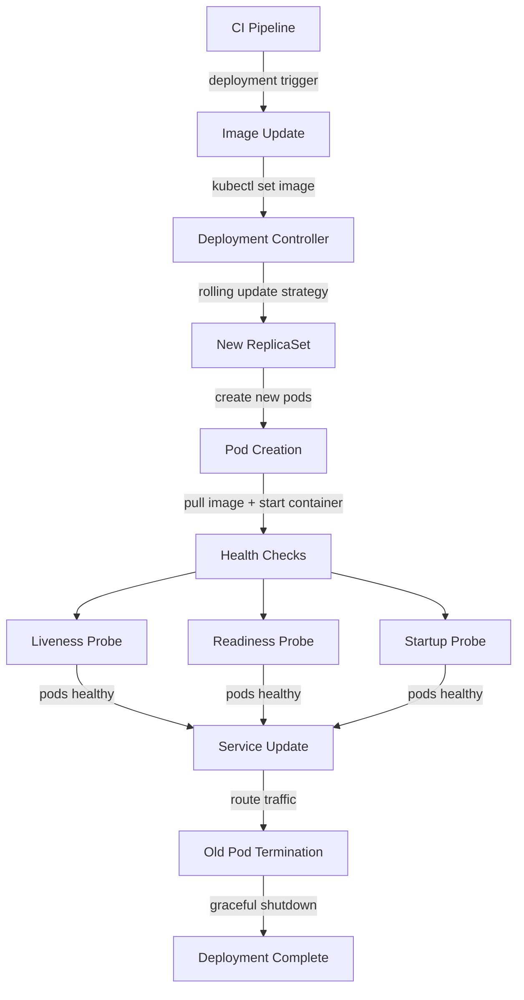

---

## 6. Canary Deployment Flow

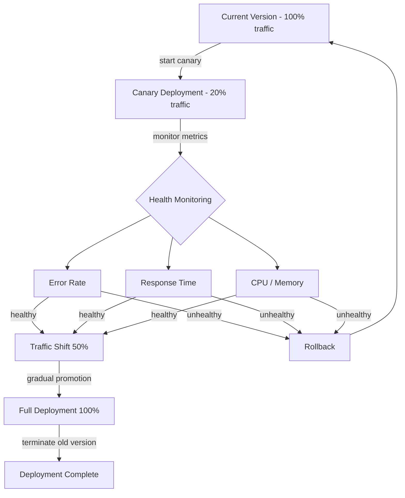

---

## 7. Data Persistence Flow

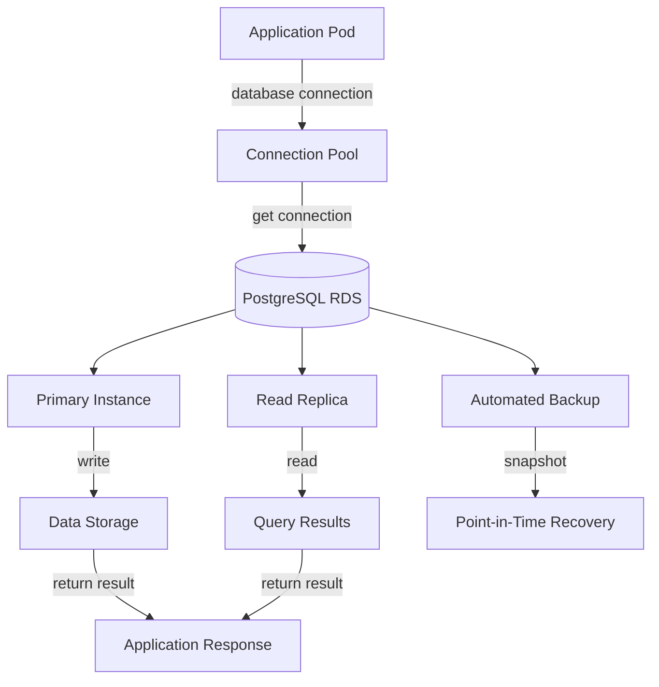

---

## 8. Caching Flow

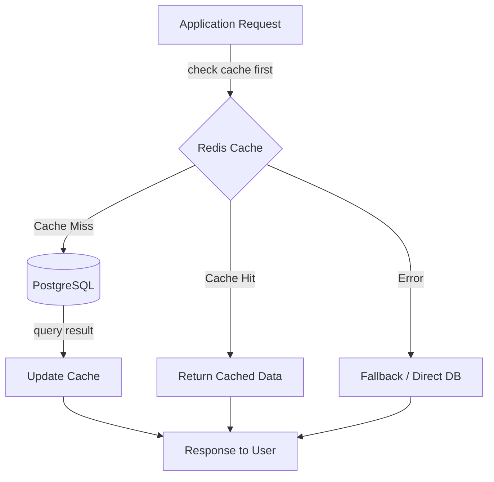

---

## 9. Monitoring & Alerting Flow

```mermaid
flowchart TD
    A[Application] --> B[/health endpoint]
    A --> C[/ready endpoint]
    A --> D[/metrics endpoint]
    B -->|Liveness| E[Kubernetes Probes]
    C -->|Readiness| E
    D -->|Custom Metrics| F[Metrics Server]
    E & F --> G[HPA Controller]
    G -->|scale decision| H[Pod Scaling]
    H -->|notification| I[Slack Alert]
```

---

## 10. Error Handling Flow

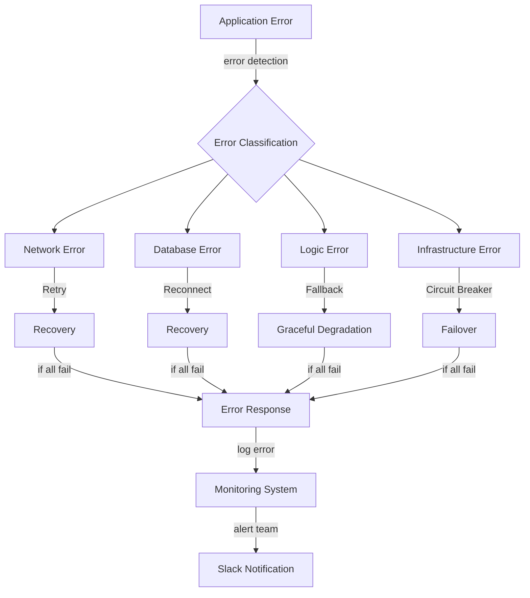

---

## 11. Backup & Recovery Flow

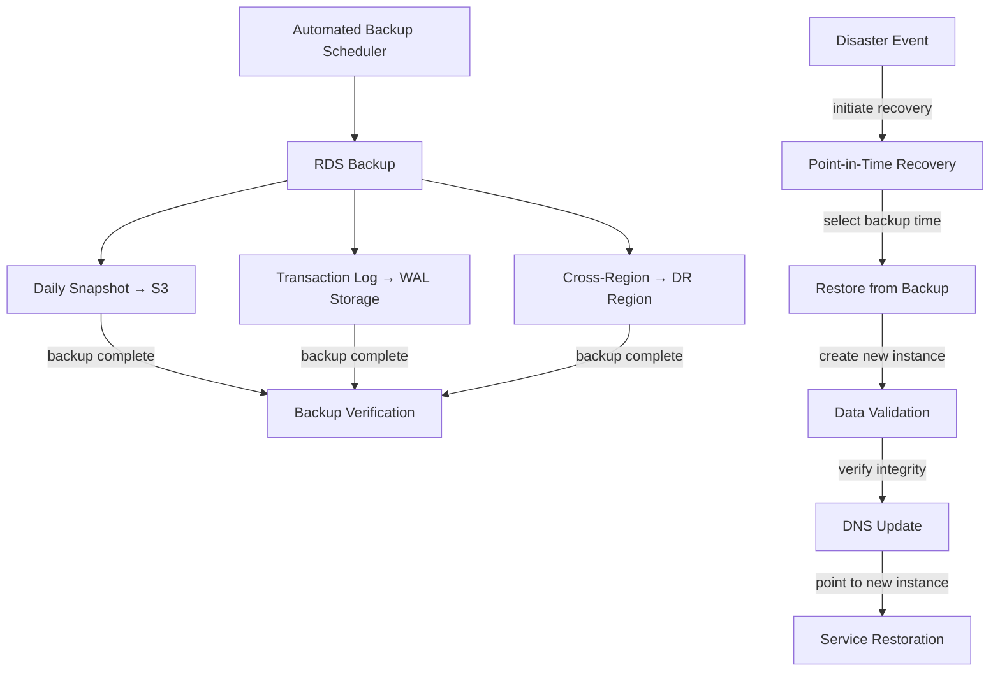

---

## 12. Cost Optimization Flow

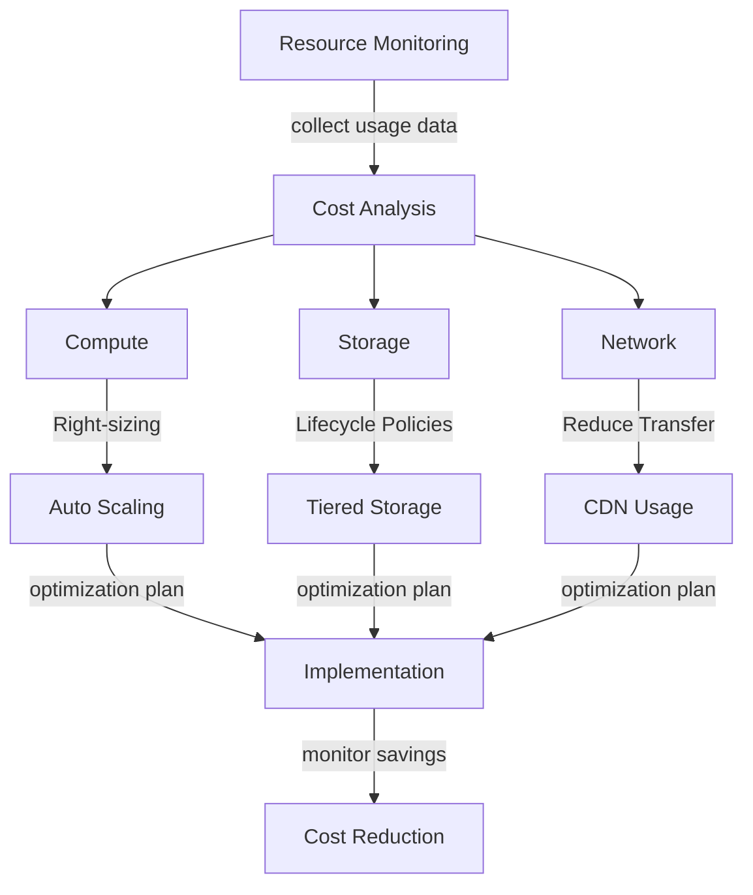

---

## 13. Compliance & Audit Flow

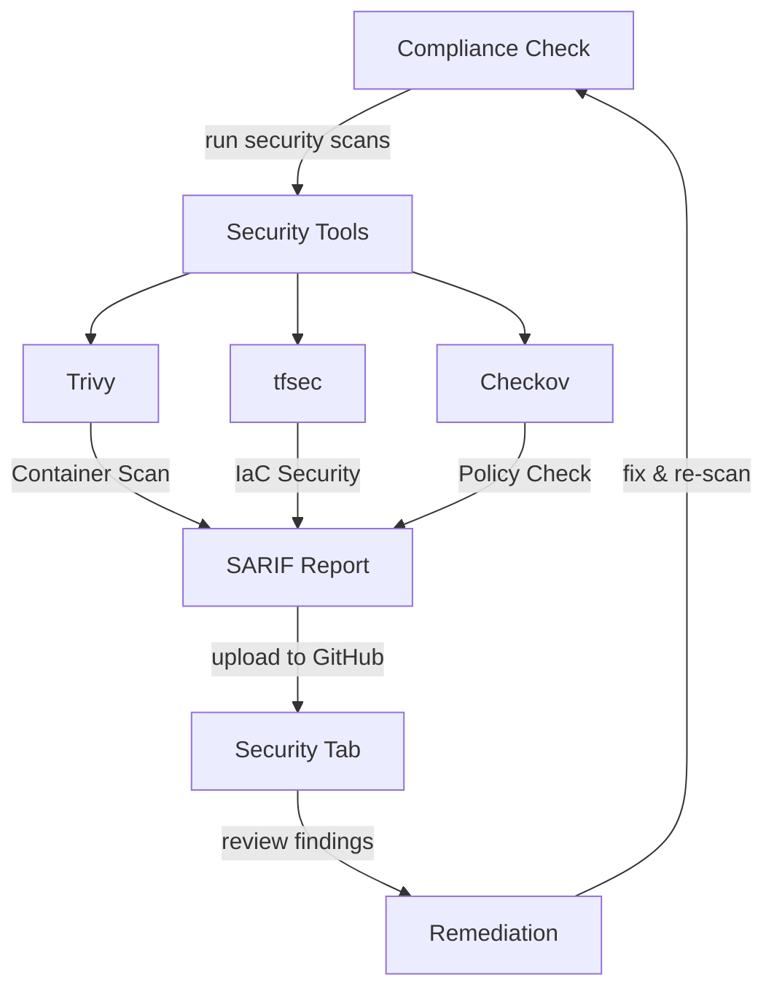

---

## 14. Feature Deployment Flow

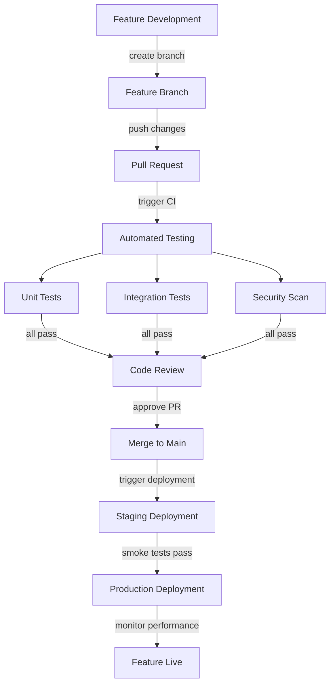

---

## 15. Troubleshooting Flow

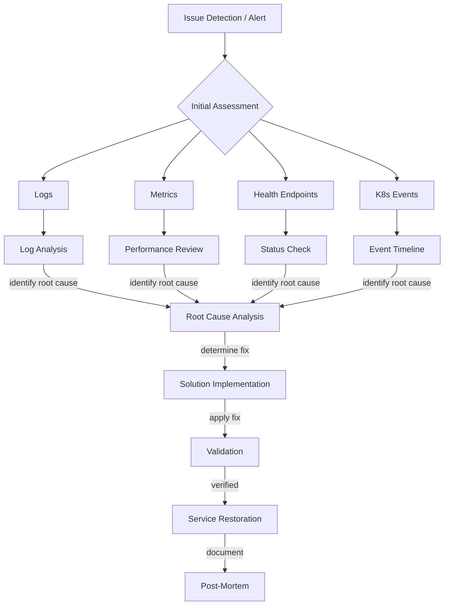
